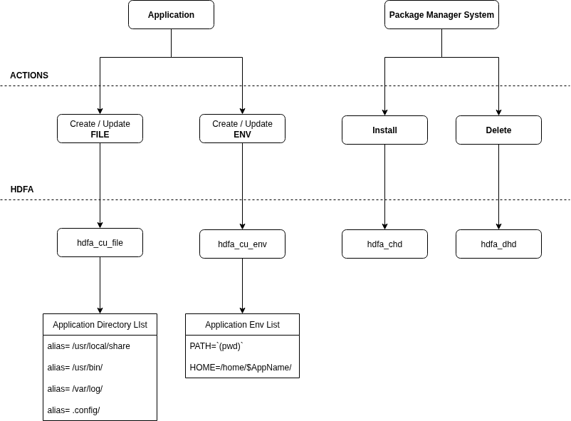

### Dependencies
```
uname -rmo  # 6.8.0-79-generic x86_64 GNU/Linux
python3 -V  # Python 3.12.3
```

```bash
sudo apt install bpfcc-tools linux-headers-$(uname -r)
```


### Run
```bash
sudo python3 main.py
```

---

<p align="center"></p>

